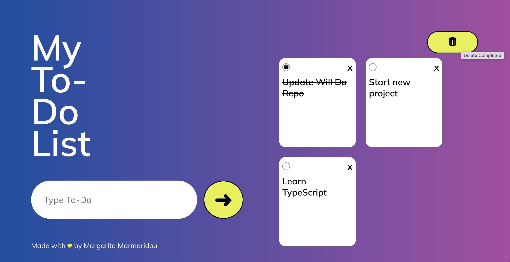

  
  <h1></h1>
  
  <h3>Keep track of all the things you need to do.</h3>

  <h3> <a target="_blank" href="https://willdo-app.netlify.app/">Try me!</a></h3>

  

  
  

## Technologies Used

&nbsp;&nbsp;&nbsp;&nbsp;&nbsp;&nbsp;

## Description

 Will Do is a simple to-do list application written in React.

Add your to-do. Delete individual to-dos. Select the completed ones and delete them all at the same time.

## Screenshots

